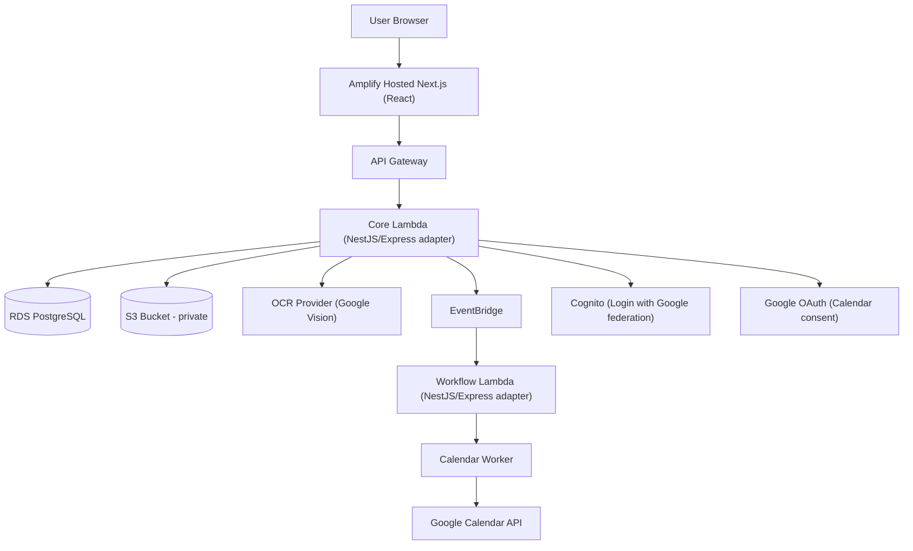

## 1. Architecture Design (AWS Microservice)

Tài liệu này bám theo các workflow diagram trong `c:\Honguyen\Patient\.trae\design\sequence\` (Login, Upload, OCR Processing, Review & Calendar Sync).



## 2. Technology Description

- Frontend: Amplify (Next.js + React + TypeScript)
- Backend: API Gateway + Core/Workflow Lambda chạy NestJS/Express (serverless adapter)
- Storage: AWS S3 private (lưu ảnh/PDF đơn thuốc) + pre-signed URL
- Database: AWS RDS PostgreSQL + Prisma (PostgreSQL + Docker cho local dev)
- Events/Async: AWS EventBridge (publish job/event)
- OCR: Google Vision (EN/VN)
- Calendar: Google Calendar API (tạo/cập nhật event + reminders)
- Auth: AWS Cognito (Login with Google federation); Google OAuth chỉ dùng khi connect Calendar

## 3. Route Definitions (Frontend)

| Route | Purpose |
|---|---|
| /login | Đăng nhập Google |
| /app | Dashboard: upload, history, search theo tên bệnh, trạng thái sync calendar |
| /prescriptions/:id/process | Bước OCR Processing: preview + bấm Process + chờ kết quả |
| /prescriptions/:id/review | Review OCR/parse + chỉnh sửa + confirm + sync calendar |
| /settings/family-access | Patient quản lý invite/accepted/revoke family access |
| /family/inbox | Family xem lời mời và accept/reject |

## 4. API Definitions (Gateway/Core)

Các endpoint dưới đây được suy ra trực tiếp từ sequence diagrams.

### 4.1 Authentication (Cognito)

Login ứng dụng do Cognito đảm nhiệm. Client nhận JWT (access/id token) trực tiếp từ Cognito.

- Backend không cần endpoint `google-login` cho login cơ bản.
- Backend xác thực request bằng cách verify JWT của Cognito.

### 4.2 Upload Prescription

```
POST /upload
```

- Auth: JWT
- Input: file (image/PDF)
- Output: `prescription_id` + metadata
- Behavior: validate file type → upload S3 → insert `prescriptions` (status=`UPLOADED`)

### 4.3 OCR + Parse

```
POST /api/prescription/{id}/process
```

- Auth: JWT (chỉ owner hoặc user được share + quyền phù hợp, nhưng action này chỉ owner)
- Behavior (sync): Core gọi trực tiếp OCR provider (EN/VN) và trả kết quả trong cùng request; đồng thời lưu `ocr_text + parsed_json` vào DB.
- Status: cập nhật `PROCESSING` trong lúc chạy; khi xong chuyển `PENDING_REVIEW` hoặc `FAILED`.
- Reliability: nếu user đóng tab khi đang process, Core vẫn cố gắng hoàn tất và persist kết quả để user mở lại có thể xem tiếp.

### 4.4 Confirm Prescription

```
POST /api/prescription/{id}/confirm
```

- Auth: JWT (owner/admin)
- Behavior: lưu dữ liệu đã xác nhận (disease + items + schedule) → status=`CONFIRMED`
- Nếu sync bật: publish event/job cho workflow calendar

### 4.5 Get Prescription + Sync Status

```
GET /api/prescription/{id}
```

- Auth: JWT
- Behavior: kiểm tra quyền (owner hoặc share accepted) → trả chi tiết + sync status (dùng cho polling mỗi 3s)

### 4.6 List / Search History

```
GET /prescriptions
GET /prescriptions?disease=keyword
```

- Auth: JWT
- Behavior: list theo owner_id + các patient mà user được share; filter `disease_name ILIKE %keyword%`

### 4.7 Family Access (Invite → Accept → Revoke)

```
POST /api/family-access/invite
GET  /api/family-access/sent
GET  /api/family-access/inbox
POST /api/family-access/{inviteId}/accept
POST /api/family-access/{inviteId}/reject
DELETE /api/family-access/{inviteId}
```

- Invite: patient nhập email family → tạo invite `pending`
- Inbox: family login → xem invites theo email
- Accept: chuyển `accepted` và gán `family_user_id`
- Revoke/Delete: patient revoke; hiệu lực ngay lập tức vì mọi request đều check DB

### 4.8 Connect Calendar (Patient/Family)

```
POST /api/calendar/connect
GET  /api/calendar/status
```

- Behavior: chạy Google OAuth calendar consent, lấy `refresh_token` và lưu theo `user_id`.
- Calendar consent áp dụng cho cả patient (sync) và family (export).

### 4.9 Family Export to Google Calendar

```
POST /api/family-export/{patientUserId}/run
```

- Preconditions: share `accepted` + family đã connect calendar.
- Behavior: publish job qua EventBridge → Workflow tạo/cập nhật events cho toàn bộ nhắc thuốc + tái khám của patient vào calendar của family.
- Revoke behavior: khi patient revoke, publish job xoá toàn bộ events đã export cho family.

## 5. Data Model (MVP)

Các bảng tối thiểu để đáp ứng: upload + OCR/parse + confirm + search disease + share family + calendar tokens.

```mermaid
erDiagram
  USERS ||--o{ PRESCRIPTIONS : owns
  USERS ||--o{ FAMILY_INVITES : sends
  USERS ||--o{ FAMILY_INVITES : receives
  PRESCRIPTIONS ||--o{ PRESCRIPTION_ITEMS : contains
  PRESCRIPTION_ITEMS ||--o{ CALENDAR_EVENTS : generates

  USERS {
    uuid id
    text email
    text role  "user|admin"
    text display_name
    timestamptz created_at
  }

  FAMILY_INVITES {
    uuid id
    uuid patient_user_id
    text invited_email
    uuid family_user_id
    text status "pending|accepted|rejected|revoked"
    timestamptz created_at
    timestamptz responded_at
    timestamptz revoked_at
  }

  GOOGLE_TOKENS {
    uuid id
    uuid user_id
    text provider "google"
    text scope "calendar"
    text refresh_token_enc
    timestamptz created_at
    timestamptz updated_at
  }

  PRESCRIPTIONS {
    uuid id
    uuid owner_id
    text disease_name
    text source_file_key
    text ocr_raw_text
    jsonb parsed_json
    jsonb confirmed_json
    text status "UPLOADED|PROCESSING|PENDING_REVIEW|CONFIRMED|FAILED"
    timestamptz created_at
    timestamptz confirmed_at
  }

  PRESCRIPTION_ITEMS {
    uuid id
    uuid prescription_id
    text med_name
    text dosage
    int times_per_day
    int duration_days
    jsonb user_schedule
  }

  CALENDAR_EVENTS {
    uuid id
    uuid prescription_item_id
    text calendar_id
    text google_event_id
    timestamptz created_at
  }

  FAMILY_EXPORT_EVENTS {
    uuid id
    uuid patient_user_id
    uuid family_user_id
    uuid prescription_item_id
    text calendar_id
    text google_event_id
    timestamptz created_at
    UNIQUE(family_user_id, google_event_id)
  }
```

## 6. Performance & NFR Notes

- Concurrency: thousand users simultaneously → stateless services + autoscaling; S3 offload file serving.
- Latency:
  - Search dưới 500ms: index `owner_id, created_at`, index + `ILIKE` optimization (trigram) cho `disease_name` nếu cần.
  - Confirm 2–3s: confirm là DB write; calendar sync chạy async qua workflow.
  - OCR sync: cần đảm bảo thời gian OCR/parse nằm trong giới hạn timeout của lớp API; nếu không, chuyển sang chế độ async (future improvement).
- Availability 99.9%: multi-AZ RDS + health checks + retry policy cho OCR/calendar.

## 7. Security Notes

- JWT auth tại Gateway; Core luôn re-check access (owner hoặc share accepted) cho mọi endpoint đọc dữ liệu patient.
- Revoke tức thì: không cache quyền share dài hạn trong token.
- Google refresh token: lưu mã hoá (KMS/secret manager) và truy cập theo `user_id`.

## 8. Private S3 Access

- File đơn thuốc lưu private trên S3.
- Core cấp pre-signed URL sau khi verify Cognito JWT và kiểm tra quyền (owner hoặc share accepted).
