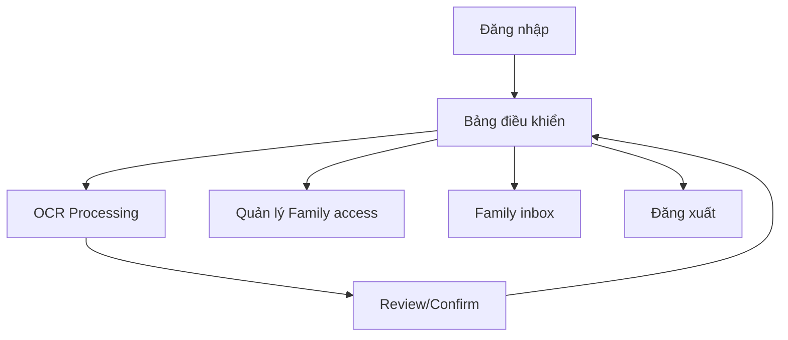

## 1. Product Overview

MVP giúp bạn đăng nhập Google, tải lên ảnh/PDF đơn thuốc, OCR + parse tiếng Việt/Anh, xác nhận lại dữ liệu và đồng bộ nhắc thuốc/tái khám vào Google Calendar.
Sản phẩm tập trung lưu trữ và tra cứu lịch sử điều trị theo tên bệnh; không có tính năng booking.

## 2. Core Features

### 2.1 Roles & Sharing Model

Sản phẩm chỉ có 2 role:

| Role    | Registration Method            | Core Permissions |
| ------- | ------------------------------ | ---------------- |
| user    | Google login                   | Upload đơn thuốc; xem/sửa/xác nhận OCR/parse; đồng bộ Google Calendar; tìm kiếm lịch sử theo tên bệnh; quản lý chia sẻ (mời/xóa/revoke). |
| admin   | Google login + set role trong DB | Tất cả quyền của `user` + quyền quản trị/giải quyết sự cố (support); không có màn hình tự cấp role trong MVP. |

**Family access (read-only)** không phải là role. Family vẫn là `user` bình thường, nhưng được cấp quyền xem dữ liệu của một patient thông qua cơ chế chia sẻ (share) ở mức patient.

### 2.2 Sharing (Invite → Accept → Access)

Mục tiêu: patient nhập email family để gia đình theo dõi, nhưng quyền chỉ **active sau khi family accept**, tránh chia sẻ nhầm.

- Patient tạo invite bằng email family → trạng thái `pending`.
- Family đăng nhập Google bằng đúng email đó → thấy danh sách invite → bấm `Accept` để kích hoạt quyền `read-only`.
- Patient có thể `Revoke` bất kỳ lúc nào; **revoke có hiệu lực ngay lập tức** (mọi request đều kiểm tra quyền theo DB).

Phạm vi dữ liệu family xem được:
- Danh sách đơn + bệnh + thuốc + lịch tái khám.
- Ảnh đơn thuốc gốc.
- Không được chỉnh sửa, không được chạy OCR lại, không được sync Google Calendar cho patient.

### 2.3 Calendar Sync & Family Export

- Patient có thể connect Google Calendar để hệ thống tạo nhắc uống thuốc và tái khám.
- Family (đã được share `accepted`) có thể `Export to my Google Calendar` để tạo nhắc vào **calendar của family**.
- Khi patient `revoke` quyền share, hệ thống sẽ **tự động xoá toàn bộ event đã export** trong Google Calendar của family (dựa trên mapping `google_event_id`).

### 2.4 Feature Module

MVP gồm các trang chính sau:

1. **Đăng nhập**: đăng nhập Google; xử lý trạng thái đăng nhập/đăng xuất.
2. **Bảng điều khiển**: upload đơn thuốc; danh sách lịch sử; tìm kiếm theo tên bệnh; trạng thái/bật tắt đồng bộ Google Calendar.
3. **OCR Processing**: bước riêng sau upload; user bấm `Process` để chạy OCR/parse và chờ kết quả.
4. **Xác nhận đơn thuốc (Review/Confirm)**: hiển thị ảnh + text OCR; bảng thuốc/nhắc tái khám đã parse; cho phép chỉnh sửa và xác nhận lưu + tạo sự kiện Calendar.

### 2.3 Page Details

| Page Name                                   | Module Name             | Feature description                                                                                                                        |
| ------------------------------------------- | ----------------------- | ------------------------------------------------------------------------------------------------------------------------------------------ |
| Đăng nhập                                   | Google Sign-in          | Thực hiện đăng nhập bằng Google; hiển thị lỗi và trạng thái phiên; đăng xuất.                                                              |
| Bảng điều khiển                             | Upload đơn thuốc        | Tải lên ảnh/PDF; hiển thị tiến trình; tạo bản ghi chờ xác nhận.                                                                            |
| Bảng điều khiển                             | Lịch sử đơn thuốc       | Liệt kê đơn theo thời gian; mở chi tiết; phân biệt đơn của bạn vs đơn được chia sẻ (Family access).                                        |
| Bảng điều khiển                             | Tìm kiếm theo tên bệnh  | Lọc danh sách theo `tên bệnh` (đã OCR/đã xác nhận); hỗ trợ tìm gần đúng (contains).                                                        |
| Bảng điều khiển                             | Đồng bộ Google Calendar | Bật/tắt sync; chọn lịch (calendar) đích; hiển thị lần sync gần nhất/ lỗi gần nhất.                                                         |
| Bảng điều khiển / Cài đặt                   | Quản lý Family access   | Nhập email để gửi invite; xem danh sách invite (pending/accepted); revoke quyền xem.                                                       |
| Bảng điều khiển / Family inbox              | Chấp nhận lời mời       | Danh sách invite từ patient; accept/reject; sau khi accept thì có thể xem dữ liệu patient.                                                  |
| OCR Processing                              | Xử lý OCR/parse         | Hiển thị preview ảnh/PDF; nút `Process`; chờ kết quả OCR/parse trả về; lỗi hiển thị inline/toast; cho phép retry.                          |
| Xác nhận đơn thuốc (OCR/Parse)              | Xem nguồn + text OCR    | Xem ảnh/PDF đã upload; hiển thị văn bản OCR; cho phép copy để đối chiếu.                                                                   |
| Xác nhận đơn thuốc (OCR/Parse)              | Parse EN/VN & chỉnh sửa | Hiển thị form: tên bệnh, danh sách thuốc (tên, liều, tần suất, thời gian), ngày bắt đầu; nhắc tái khám (ngày); cho phép thêm/xóa/sửa dòng. |
| Xác nhận đơn thuốc (OCR/Parse)              | Xác nhận & tạo nhắc     | Lưu dữ liệu đã xác nhận; tạo/cập nhật sự kiện Google Calendar (nhắc thuốc định kỳ + tái khám 1 lần) theo lựa chọn sync.                    |

### 2.5 Authentication & Consent

- Login: dùng AWS Cognito. User đăng nhập bằng `Login with Google` thông qua Cognito federation (scope cơ bản: profile/email).
- Google Calendar: chỉ xin consent (Google OAuth calendar scope) khi user bật sync/export.

### 2.6 Supported Languages

- UI: có toggle `EN/VN` trong app (mặc định EN).
- OCR/parse: hỗ trợ cả tiếng Việt và tiếng Anh.

## 3. Core Process

**User Flow**

1. Đăng nhập Google.
2. Upload ảnh/PDF đơn thuốc.
3. Bấm `Next` để tới bước `OCR Processing`.
4. Bấm `Process` để chạy OCR + parse (VN/EN) và chờ kết quả trả về.
5. Sau khi có kết quả, chuyển sang màn `Review/Confirm`.
6. Bạn đối chiếu, chỉnh sửa nếu cần, nhập/điều chỉnh tên bệnh.
7. Xác nhận lưu.
8. (Tuỳ chọn) Bật sync Google Calendar → hệ thống tạo sự kiện nhắc uống thuốc và sự kiện tái khám.
9. Trở về Bảng điều khiển → tìm kiếm lịch sử theo tên bệnh, mở xem lại chi tiết.

**Invite Family Flow (Patient)**

1. Vào Cài đặt → nhập email family.
2. Hệ thống tạo invite trạng thái `pending`.
3. Khi family accept, trạng thái chuyển `accepted`.
4. Patient có thể revoke bất kỳ lúc nào.

**Family Export Calendar Flow**

1. Family accept invite.
2. Family bấm `Export to my Google Calendar`.
3. Nếu chưa connect calendar: hệ thống yêu cầu consent Google Calendar scope cho family.
4. Workflow tạo events nhắc thuốc + tái khám vào calendar của family.
5. Nếu patient revoke: workflow xoá các events đã export cho family.

**Family Flow (Accept + View)**

1. Đăng nhập Google bằng email được mời.
2. Mở “Family inbox” → accept invite.
3. Xem danh sách đơn của patient được chia sẻ (read-only).

## 4. Security & Privacy Notes (MVP)

- Access control: mọi API đọc dữ liệu theo share phải kiểm tra quyền trong DB (để revoke hiệu lực ngay lập tức).
- Family access là read-only: không được chỉnh sửa, không được re-process OCR, không được sync calendar cho patient.
- Audit: log các sự kiện share/invite/accept/revoke tối thiểu để truy vết.

## 5. File Access (S3)

- Ảnh/PDF đơn thuốc lưu S3 ở chế độ private.
- Frontend chỉ tải được ảnh thông qua pre-signed URL do backend cấp sau khi kiểm tra quyền (owner hoặc share accepted).

## 6. Reference Diagrams

Các sequence diagram đã được vẽ trong `c:\Honguyen\Patient\.trae\design\sequence\` (Login, Upload, OCR Processing, Review & Calendar Sync).
